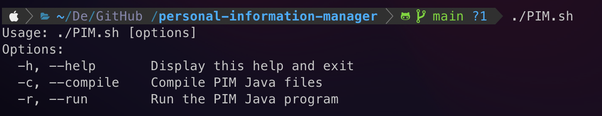

# Personal Information Manager (Command Line Interface)

## Description

A personal information manager that can write notes & add contacts & create some tasks and events that will notify the user.

## Running Platform & Programming Language & File Format

- MacOS & Linux & Unix
- Java (JDK Version 17)
- Data File - CSV

## Code Structure

```bash
.
├── controller
│   ├── Auth.java
│   ├── Contact.java
│   ├── Event.java
│   ├── Export.java
│   ├── Import.java
│   ├── Input.java
│   ├── Note.java
│   ├── PIM.java
│   ├── Search.java
│   └── Todo.java
├── model
│   └── SimpleDatabase.java
└── view
    └── Pages.java
```

## Code Usage

- Terminal

  - PIM Compile

    ```bash
    ./PIM.sh -c
    ## OR
    ./PIM.sh --compile
    ```

  - PIM Help

    ```bash
    ./PIM.sh -h
    ## OR
    ./PIM.sh --help
    ## OR
    ./PIM.sh
    ```

    

- IntelliJ IDEA

  - PIM Compile & Running

    

    

  - Unit Test

    

    

## File Database Design


| userID | userName | password |
| ------ | -------- | -------- |
|        |          |          |

| contactID | userID | firstName | lastName | phoneNumber | address |
| --------- | ------ | --------- | -------- | ----------- | ------- |
|           |        |           |          |             |         |

| noteID | userID | noteTitle | noteContent | lastModifyTime |
| ------ | ------ | --------- | ----------- | -------------- |
|        |        |           |             |                |

| taskID | userID | taskTitle | taskDescription | taskDDL |
| ------ | ------ | --------- | --------------- | ------- |
|        |        |           |                 |         |

| eventID | userID | eventTitle | eventDescription | eventStartTime | eventAlarm |
| ------- | ------ | ---------- | ---------------- | -------------- | ---------- |
|         |        |            |                  |                |            |

## Contributors

- HU Yuhang
- MENG Guanlin
- JIANG Guanlin
- YE Feng
